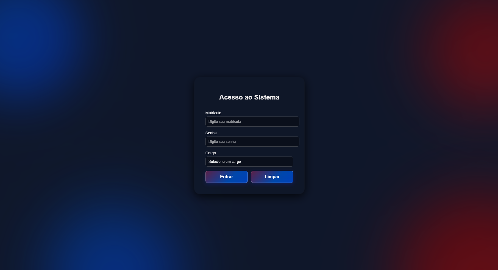

# 🔐 Login Interativo


Uma interface de login moderna e interativa, desenvolvida para demonstrar conceitos de validação de formulários, efeitos visuais com *glassmorphism* e animações líquidas em CSS. Projeto acadêmico para a disciplina de Desenvolvimento Web.

## Screenshots

### Tela de Login


### Alerta de Campos Vazios


### Mensagem de Boas‑vindas


> 📸 *As imagens acima são ilustrativas; substitua pelos prints reais do seu projeto.*

## Sobre o Projeto

Este projeto apresenta um formulário de acesso com três campos obrigatórios (matrícula, senha e cargo). Ao submeter, o sistema valida se todos os campos foram preenchidos e exibe uma mensagem de boas‑vindas com os dados inseridos. O visual é composto por um cartão com efeito *glassmorphism*, fundo com *blobs* animados e botões com gradiente em movimento.

## Tecnologias Utilizadas

- **HTML5** – estrutura semântica do formulário.
- **CSS3** – estilização com *flexbox*, animações e efeitos de transparência.
- **JavaScript** – manipulação do DOM, captura de eventos e validação dos campos.

## Funcionalidades

-  Formulário com campos: **Matrícula**, **Senha** e **Cargo** (Diretor, Professor, Aluno).
-  Validação em tempo real: alerta caso algum campo esteja vazio.
-  Feedback visual: exibe uma mensagem de boas‑vindas com os dados preenchidos.
-  Botão **Entrar** com efeito *hover* e animação de gradiente.
-  Botão **Limpar** que reseta todos os campos.
-  Design responsivo e moderno com efeito *glassmorphism*.
-  Animações suaves nos *blobs* de fundo (movimento líquido contínuo).

## Detalhes Visuais

O projeto utiliza uma paleta de cores que combina azul e vermelho em gradientes:

- **Fundo**: azul escuro (#0f172a)
- **Blobs animados**: gradientes alternando entre azul e vermelho
- **Cartão de login**: fundo transparente com desfoque (*backdrop-filter*)
- **Botões**: gradiente animado com transição de cores
- **Efeito *hover***: elevação e sombra nos botões

## Como Executar

1. Clone o repositório:
   ```bash
   git clone https://github.com/seu-usuario/login-interativo.git
