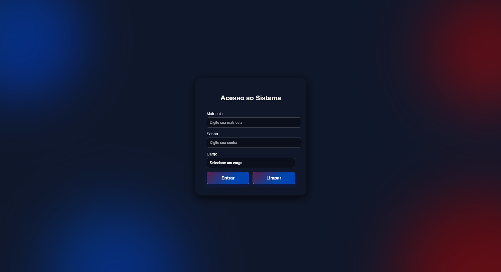
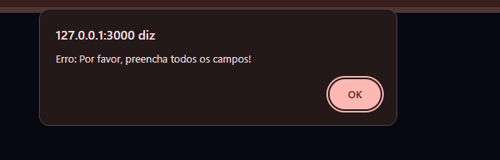
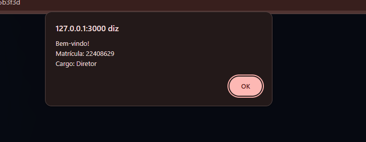
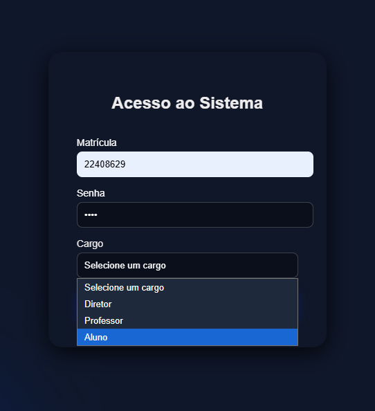

# Login Interativo


## Sobre o Projeto

Projeto desenvolvido como atividade da disciplina de Desenvolvimento Web do curso de Engenharia da Computação (CEUB).

A proposta consistiu na criação de uma interface de login moderna e interativa, aplicando conceitos fundamentais de HTML, CSS e JavaScript. O sistema realiza validação de formulários, manipulação do DOM e exibição dinâmica de mensagens ao usuário, além de explorar recursos avançados de estilização visual e animações.

O projeto foi desenvolvido com foco na experiência do usuário, combinando funcionalidades de validação com uma interface moderna baseada em efeitos visuais contemporâneos.

---

## Screenshots

### Tela de Login



### Alerta de Campos Vazios



### Mensagem de Boas-vindas



### Seleção de Cargos



---

## Funcionalidades

* Formulário de autenticação com múltiplos campos
* Campo de matrícula
* Campo de senha
* Seleção de cargo (Diretor, Professor ou Aluno)
* Validação de campos obrigatórios
* Exibição de alertas para informações ausentes
* Mensagem dinâmica de boas-vindas após o envio
* Botão para limpeza dos campos
* Feedback visual durante a interação do usuário
* Interface totalmente responsiva

---

## Tecnologias Utilizadas

| Tecnologia | Descrição                                |
| ---------- | ---------------------------------------- |
| HTML5      | Estruturação semântica do formulário     |
| CSS3       | Estilização, animações e responsividade  |
| JavaScript | Validação dos dados e manipulação do DOM |
| Flexbox    | Organização e alinhamento dos elementos  |

---

## Destaques do Design

* Interface baseada no conceito de glassmorphism
* Fundo com elementos animados em movimento contínuo
* Efeito de transparência utilizando backdrop-filter
* Botões com gradientes animados
* Efeitos hover para aumentar a interatividade
* Combinação de tons de azul e vermelho para criar contraste visual
* Layout centralizado e adaptável para diferentes dispositivos

---

## Conceitos Aplicados

* Estruturação de formulários HTML
* Manipulação de eventos em JavaScript
* Validação de entrada de dados
* Seleção e atualização de elementos do DOM
* Responsividade com CSS
* Animações e transições visuais
* Experiência do usuário (UX)

---

## Como Executar

1. Clone o repositório:

   ```bash
   git clone https://github.com/FaculdadeJV/Tela-de-Login.git
   ```

2. Acesse a pasta do projeto

3. Abra o arquivo `index.html` em qualquer navegador moderno

---

## Autor

* Victor (Jonathan) Arsego Lêla
* RA: 22408629
* Engenharia da Computação - CEUB

---

Este projeto foi desenvolvido para fins acadêmicos na disciplina de Desenvolvimento Web do CEUB.

---
